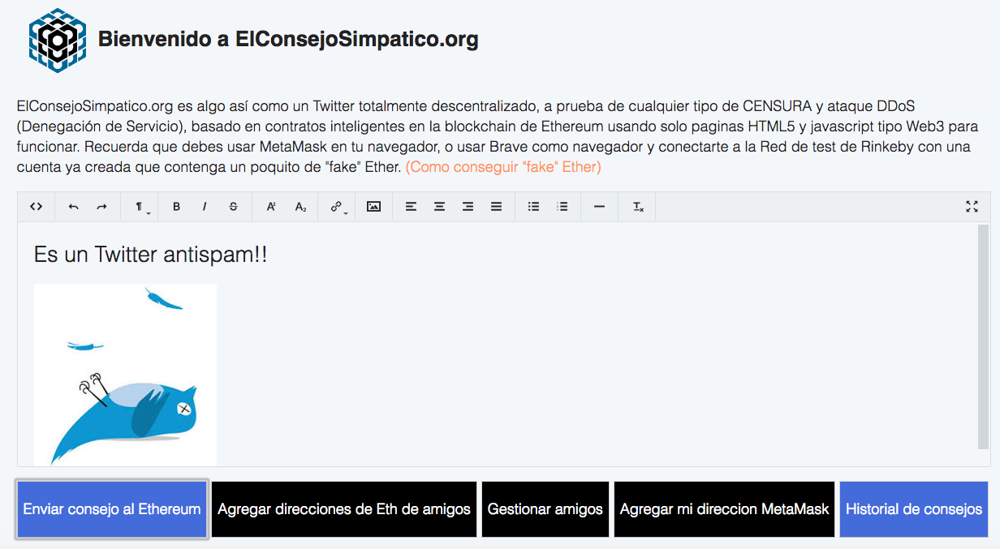
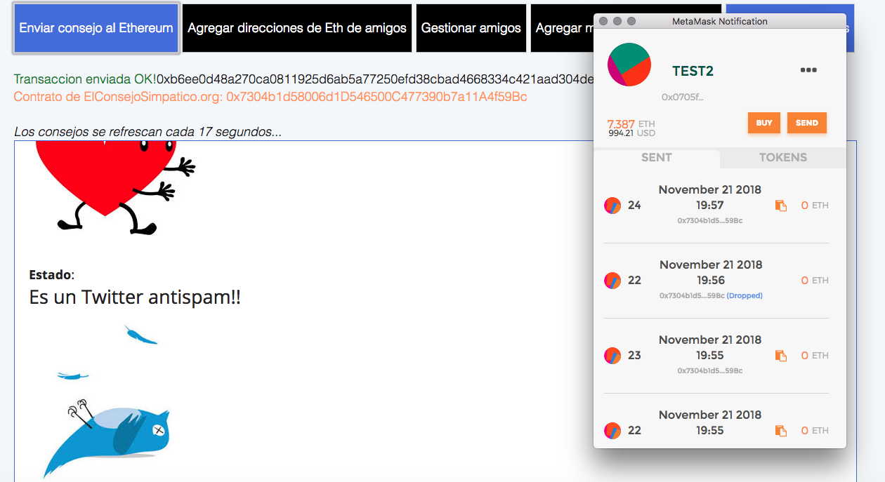
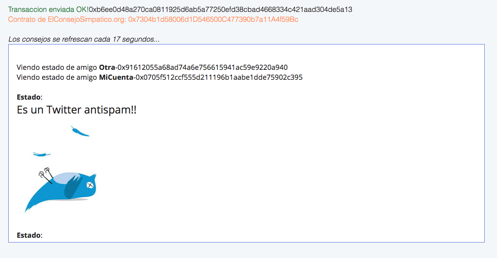

## Welcome to ElConsejoSimpatico

Try it on the following website:

[https://elconsejosimpatico.github.io/](https://elconsejosimpatico.github.io/)

ElConsejoSimpatico.org is something like a totally decentralized Twitter, to test any type of CENSORSHIP and DDoS attack (Denial of Service), based on smart contracts in the blockchain of Ethereum using only HTML5 pages and javascript type Web3 to work. Remember that you must use MetaMask in your browser, or use Brave as a browser and connect to the Rinkeby test network with an account already created that contains a bit of "fake" Ether.

### Make a fork and install it wherever you want

Post it on any webserver (since it only uses HTML5 and Javascript to work).
Copy and go! You can even post it as a GitHub website!

### Contact and other details

Created by [MrAddon](http://mraddon.com) 2018 @Barcelona. Using the plugin [Trumbowyg](https://alex-d.github.io/Trumbowyg/) for the HTML Enriched Text edit field WYSIWYG.

### Some images of the Dapp

Send enriched content in the form of advice to Ethereum Rinkeby. (To send the advice you must pay a little "fake" Ether)

Read the advice of your friends. These tips are stored in the Ethereum Rinkeby blockchain

A different Twitter and without SPAM, or ads, with a high-tech anti-censorship system, where the important thing is the friendly advice that you are going to give to the small island called the world!

By MrAddon :)

